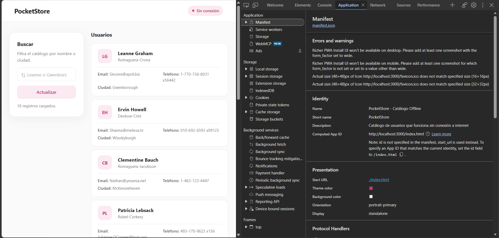
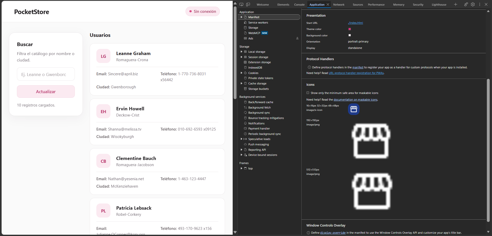
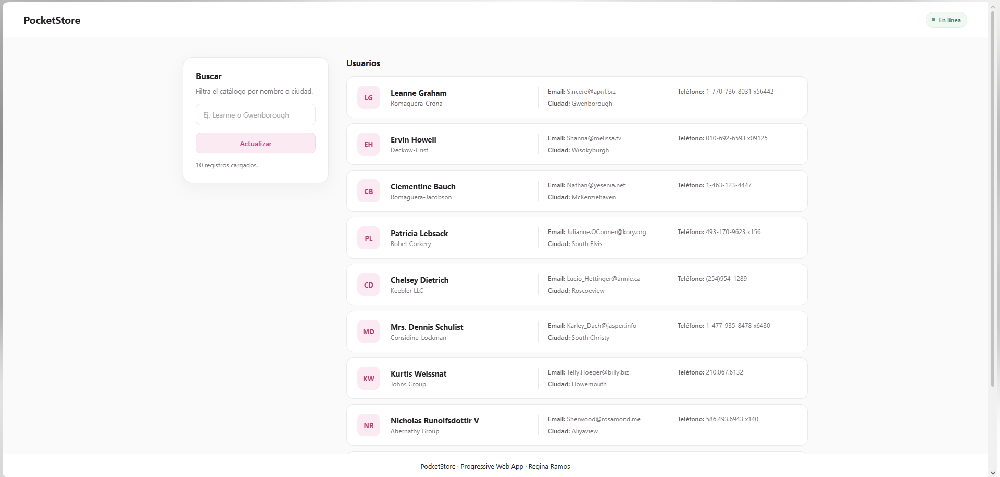
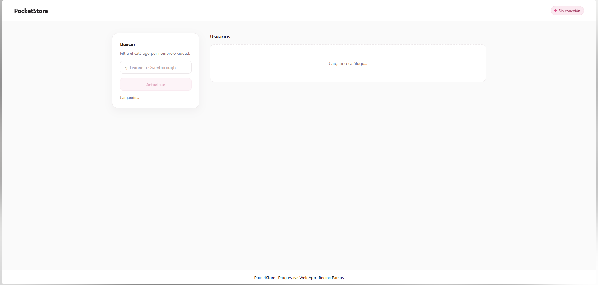
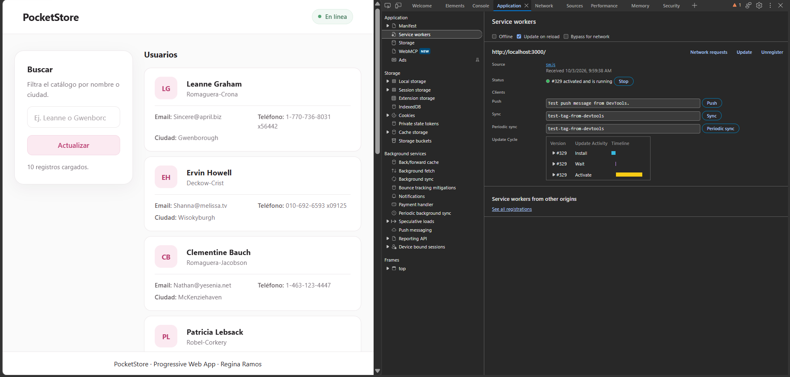
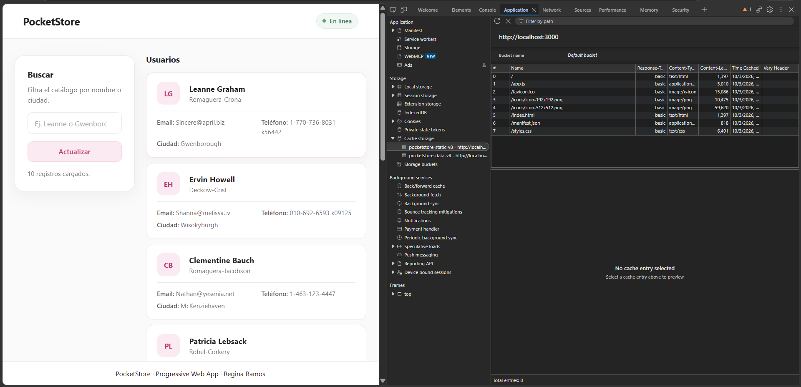
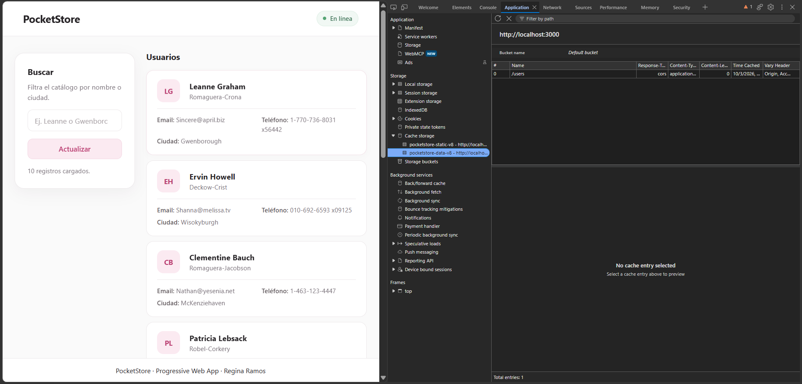
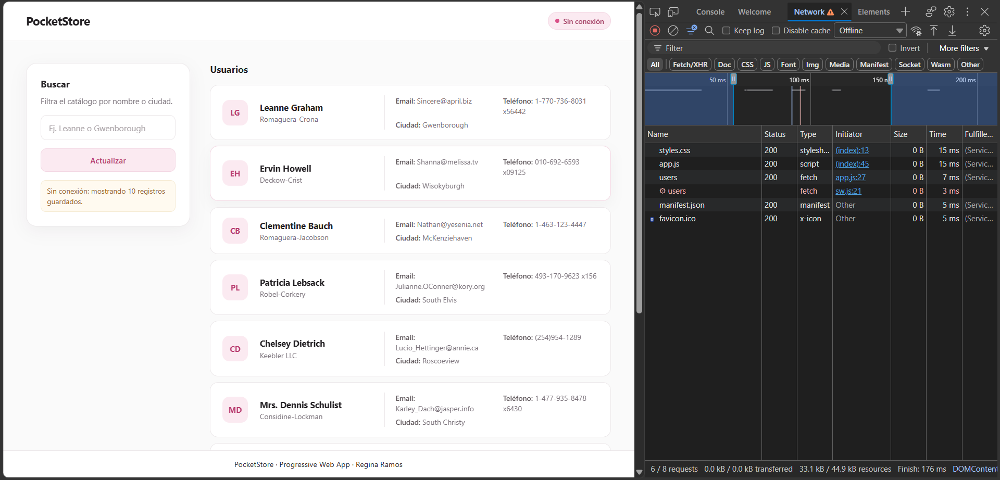

# PocketStore

SPA que muestra un catálogo de usuarios obtenido de la API pública JSONPlaceholder y que funciona sin conexión a internet mediante un Service Worker y la Cache API.

## Tech stack
- HTML5, CSS3 y JavaScript (Vanilla JS)
- Service Worker y Cache API
- Web App Manifest
- API: https://jsonplaceholder.typicode.com/users

## Estructura del proyecto
```
pocket-store/
├── index.html      # Vista (App Shell)
├── styles.css      # Estilos del App Shell
├── app.js          # Lógica de la aplicación y registro del SW
├── sw.js           # Service Worker y manejo de caché
├── manifest.json   # Configuración de instalación
├── favicon.ico     # Icono de la pestaña
├── icons/          # Iconos 192x192 y 512x512
└── docs/img/       # Imágenes del proceso de desarrollo
```

## 1. Manifiesto (manifest.json)
Define el nombre, nombre corto, URL de inicio, modo `standalone`, colores de la aplicación e iconos de 192x192 y 512x512 que permiten instalarla.




## 2. App Shell (index.html y styles.css)
Estructura fija con barra superior, contenedor principal y pie de página. El contenido se organiza en una proporción 1:3: un panel de búsqueda a la izquierda y la lista de personas a la derecha. En pantallas pequeñas ambos paneles se apilan.



El App Shell se guarda en caché al instalar el Service Worker, por lo que carga de inmediato aunque no haya conexión.




## 3. Service Worker (sw.js)
- **install:** guarda en caché los archivos del App Shell y los datos iniciales de la API. Cada archivo se guarda por separado para identificar en consola cuál falla, si ocurre un error.
- **activate:** elimina cachés de versiones anteriores.
- **fetch:**
  - API → *Network First*: consulta la red con un límite de 4 segundos y guarda una copia; si no hay conexión o no responde, usa la caché.
  - Archivos estáticos → *Cache First*: responde desde la caché y usa la red solo si el archivo no está guardado.

Al buscar en caché se usa `ignoreVary: true`, porque la API responde con el encabezado `Vary: Origin`, lo que impedía encontrar los datos guardados.






## 4. Contenido dinámico (app.js)
Consume la API con `fetch()`, genera la lista de personas, permite buscar por nombre o ciudad y muestra el estado de conexión. Si la red no responde en 5 segundos, la petición se cancela y los datos se leen directamente de la caché.

Manejo de errores:
- Respuesta inválida o error del servidor: mensaje de error y botón para reintentar.
- Sin conexión y con datos en caché: se muestran los datos guardados con un aviso.
- Sin conexión y sin datos guardados: mensaje indicando que se requiere conexión.


## Prueba offline
1. Abrir la app con conexión para guardar la caché.
2. En DevTools > Network seleccionar **Offline**.
3. Recargar la página: el catálogo sigue disponible.



## Instalación
Desde Chrome o Edge, usar el icono de instalar en la barra de direcciones. La app instalada se abre en su propia ventana y funciona sin conexión.


## Cómo ejecutar
```bash
npx http-server -p 3000 -c-1
```
Abrir http://localhost:3000

## Créditos
Icono de Material Symbols de Google.

## Autor
Regina Ramos